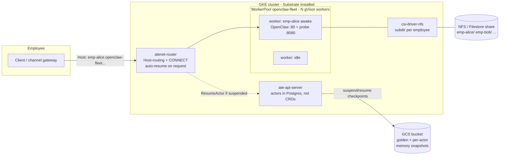

# OpenClaw Fleet on Agent Substrate: per-employee agent workspaces on GKE

This demo is a measured blueprint for operating a **fleet of per-employee
[OpenClaw](https://openclaw.ai) agent workspaces on Substrate** — the shape a
company takes when it gives every employee a personal, persistent AI-agent
workspace that must feel always-on while actually running almost never. It is
the Substrate counterpart of the
[agent-sandbox `openclaw-fleet-gke` example](https://github.com/kubernetes-sigs/agent-sandbox/tree/main/examples/openclaw-fleet-gke),
proving the same six fleet requirements with an asserting test script
([`run-test-gke.sh`](run-test-gke.sh)), and it builds on the single-agent
[always-on-agent](https://github.com/agent-substrate/always-on-agent)
integration (same actor image recipe; no OpenClaw source changes).

| # | Fleet requirement | Substrate mechanism | Verdict |
|---|---|---|---|
| 1 | Fast creation & activation; batch onboarding | `CreateActor` = a DB registration; first request restores the template's **golden snapshot** into a pre-warmed worker | ✅ create; ⚠️ activation is seconds (not sub-second) for a real OpenClaw actor; ❌ no bulk API |
| 2 | Deletion releases every resource | `DeleteActor --any-state` frees the worker, deletes the per-actor CSI volume and every snapshot under the actor's UID prefix | ✅ verified |
| 3 | Sleep releases compute; wake-up measured; state preserved | `SuspendActor` checkpoints **live memory + rootfs** to GCS and frees the worker; the next request auto-resumes (atenet ext_proc) | ✅ verified — same `boot_id`, in-memory counter intact; ⚠️ idle *policy* is yours to run |
| 4 | Fleet-wide image/config updates, CPU/mem resizes | none natively — ActorTemplates are **immutable**; the only path is create-template-v2 + repoint each suspended actor (`UpdateActor`), which **discards memory state** | ❌ needs Substrate work ([gaps](#what-does-not-work-yet-substrate-gaps)) |
| 5 | Per-employee ~20 GB NAS workspace, thousands of users | `externalVolumeTemplate` → one CSI volume per actor; with `csi-driver-nfs` each volume is a **subdirectory of one NFS/Filestore share**; excluded from snapshots, reattached on resume | ✅ verified, with caveats (no quota enforcement) |
| 6 | Distinct, stable address per employee | `<actor>.<atespace>.actors.resources.substrate.ate.dev`, Host-routed by atenet, **wake-on-request** built in — no per-employee Service/alias objects at all | ✅ verified — Substrate's strongest answer |

The central design difference from the Kubernetes-native (agent-sandbox)
blueprint: there, a *pod* is the unit of sleep, so waking means rescheduling
and rebooting the app (~20 s), and sub-second onboarding needs a warm pool of
already-running pods. Here, the *process image* is the unit of sleep: every
employee's agent is a suspended memory snapshot, waking resumes it
mid-thought in seconds without any pod churn, and "warm pool" is just the
worker pool every actor multiplexes onto. The trade arrives at update time:
the snapshot **is** the state, so anything that invalidates it (image bump,
resize, key rotation) is a fleet-wide state-loss event to manage.

## Architecture



Employee lifecycle, entirely through the ate API (no portal layer needed —
compare the ~550-line portal the agent-sandbox blueprint carries):

```mermaid
stateDiagram-v2
    [*] --> Registered: CreateActor (ms, DB row only)
    Registered --> Serving: first request<br/>golden restore, seconds
    Serving --> Suspended: SuspendActor<br/>(your idle policy)
    Suspended --> Serving: any request<br/>auto-resume, same memory
    Suspended --> Suspended: UpdateActor -> template v2<br/>(fleet update; memory discarded,<br/>workspace volume kept)
    Serving --> [*]: DeleteActor --any-state<br/>volume + snapshots deleted
```



## Files

| File | Role |
|---|---|
| [`openclaw-fleet.yaml.tmpl`](openclaw-fleet.yaml.tmpl) | Namespace + `WorkerPool`: N gVisor workers = the fleet's *concurrency* ceiling (fleet size is unbounded by it). |
| [`openclaw-fleet-template.yaml.tmpl`](openclaw-fleet-template.yaml.tmpl) | The `ActorTemplate` (protojson, not a CRD): OpenClaw on port 80, test probe on 8080, FULL snapshots, 20 Gi external volume per employee. |
| [`build/`](build/) | Actor image: stock public OpenClaw + fleet config (adapted from always-on-agent). Digest-pinned base — snapshots are image-exact. |
| [`probe/`](probe/) | Test-instrumentation sidecar (Substrate has no `exec` into actors): boot ID + in-memory counter distinguish memory-restore from cold boot; workspace endpoints prove the volume. |
| [`tools/update-actor/`](tools/update-actor/) | Repoints an actor at a new template via `UpdateActor` — the RPC exists but `kubectl-ate` has no verb for it yet. |
| [`deploy.sh`](deploy.sh) | Build images (Cloud Build + ko), worker pool, atespace, template, golden snapshot wait. |
| [`run-test-gke.sh`](run-test-gke.sh) | Asserting walkthrough of requirements 1–6 (section numbering mirrors the agent-sandbox example). |
| [`rolling-update.sh`](rolling-update.sh) | Rate-limited fleet migration to a new template (the lossy update path, made explicit). |
| [`tools/measure-activation-latency.sh`](tools/measure-activation-latency.sh) | suspend/wake percentiles over N cycles. |
| [`teardown.sh`](teardown.sh) | Actors → templates → atespace → pool, in the order that avoids wedging. |

## Walkthrough

### 0. Prerequisites

A GKE cluster that Substrate can run on — the PodCertificate beta APIs must
be enabled **at cluster creation** (GKE 1.36; default-served on 1.37+):

```sh
gcloud container clusters create openclaw-fleet-sub \
  --zone us-east4-a --cluster-version 1.36.4-gke.1082000 \
  --num-nodes 3 --machine-type c3-standard-4 \
  --workload-pool <PROJECT>.svc.id.goog --enable-dataplane-v2 \
  --enable-kubernetes-unstable-apis=certificates.k8s.io/v1beta1/podcertificaterequests,certificates.k8s.io/v1beta1/clustertrustbundles
```

A snapshot bucket with Workload Identity grants for `ate-system/atelet`
**and** `ate-system/ate-api-server` (`roles/storage.objectAdmin` +
`roles/storage.bucketViewer`; missing the api-server half wedges actors on
their second suspend). Then, from this checkout:

```sh
cp hack/ate-dev-env.sh.example .ate-dev-env.sh   # edit project/cluster/bucket
hack/install-ate.sh --deploy-ate-system --setup-csi=nfs
make build-atectl        # kubectl-ate on PATH
```

`--setup-csi=nfs` deploys an in-cluster NFS server + `csi-driver-nfs` +
`CSIDriverConfig` — fine for the demo. For production, point the
`csi-nfs-sc` StorageClass at a Filestore instance instead
(`parameters: {server: <filestore-ip>, share: /<share>}`); the CSI driver
then provisions **one subdirectory per employee on one share**, the same
thousands-of-users shape as the agent-sandbox blueprint, with no per-user
PV/PVC objects.

### 1. Deploy

```sh
export PROJECT_ID=<project> BUCKET_NAME=<snapshot-bucket>
./deploy.sh                                          # template v1
TEMPLATE_NAME=openclaw-fleet-v2 TEMPLATE_REV=v2 ./deploy.sh   # v2, for the update test
```

`deploy.sh` Cloud-Builds the actor image (stock OpenClaw + config), ko-builds
the probe and the ateom worker from this checkout, applies the pool, creates
the atespace + template, and waits for the **golden snapshot** — the one-time
warm-boot of OpenClaw whose checkpoint every employee's first activation
restores from. Onboarding N employees costs N database rows, not N boots.

### 2. Run the asserting test

```sh
BUCKET_NAME=<snapshot-bucket> ./run-test-gke.sh
```

### 3. Fleet update (the honest version)

```sh
ATESPACE=openclaw-fleet ./rolling-update.sh openclaw-fleet-v2
```

Every actor is suspended, repointed, and cold-restores (data-only) on its
next request: config/image now v2, **conversation memory gone, workspace
volume intact**. There is no way to update a fleet without this loss today —
see the gaps section.

## Measured results

<!-- MEASURED-RESULTS: filled from the live validation run -->
*(pending live run — see PR/branch notes)*

## What works

- **Wake-on-request with a stable per-employee address** is built into the
  data plane: the DNS name is deterministic, survives suspend/resume/
  rescheduling, and a request to a sleeping employee just… works. The
  agent-sandbox blueprint needs a portal, alias Services, and a router
  deployment to approximate this; here it is zero per-employee objects.
- **True memory-state sleep**: the employee's agent resumes with its process
  memory (session context, JIT warm-up) intact — verified by boot-ID and
  in-memory-counter continuity across suspend/resume. Disk-tier sleep in the
  agent-sandbox blueprint reboots the app instead (~20 s wake, state only as
  good as what OpenClaw flushed to disk).
- **Fleet-size decoupling**: registered employees are DB rows; only
  *concurrently active* employees consume compute (1 awake actor : 1 worker).
- **Per-employee volumes with actor-scoped lifecycle**: provisioned at
  create, detached at suspend, deleted at delete — no PV/PVC sprawl.
- **Clean deletion**, including snapshots under the actor's UID prefix and
  the CSI volume.

## What does NOT work yet (Substrate gaps)

Ordered by how hard they bite this use case:

1. **No fleet update story.** ActorTemplates are immutable, there is no
   rollout primitive, and repointing an actor (`UpdateActor`) forces a
   data-only restore — memory state is discarded fleet-wide on every image
   or config change. Resizes (`resources.limits`) are also template-bound
   and take effect only on cold boot. Roadmap lists "ActorDeployment"; until
   then [`rolling-update.sh`](rolling-update.sh) is the state of the art.
2. **Secrets are baked into the golden snapshot.** Template env is
   literal-only (no `secretKeyRef` since upstream #835); a provider-key
   rotation means new template + re-golden + lossy fleet migration. Egress
   credential injection is the missing tier.
3. **No idle-suspend policy in the control plane.** Suspension is
   caller-driven; every deployment must run its own idle detector (the
   always-on-agent gateway plugin is the reference implementation).
4. **No bulk APIs.** Onboarding thousands = client-side `CreateActor`
   fan-out; offboarding likewise.
5. **Activation is seconds, not sub-second, for real agents.** The
   sub-second figures hold for near-empty actors; a full Node.js OpenClaw
   restore is a 55–60 MiB memory image (~3 s handler time, 3–5 s end-to-end
   as measured in always-on-agent). Still far better than a cold boot, but
   size expectations accordingly.
6. **No `kubectl-ate update actor`** — the RPC exists, the CLI verb doesn't
   (this demo carries [`tools/update-actor`](tools/update-actor/)).
7. **No exec/cp/debug path into actors** — hence the probe sidecar pattern
   this demo uses for testing; operators will want something first-class.
8. **Volume capacity is bookkeeping, not enforcement**, with the NFS driver:
   nothing stops an employee filling the shared share past their 20 Gi.
   (Filestore multishares or an enforcing CSI driver would fix this.)
9. **Static worker pools.** No autoscaling; concurrent-active demand beyond
   the pool parks for ≤5 s, then 503s. Sizing is on you (see the
   always-on-agent density model: P99-peak, not average).
10. **In-cluster-only ingress.** atenet-router is ClusterIP; the external
    per-employee URL (LB, TLS, IAP/SSO) is entirely left to the operator —
    the agent-sandbox blueprint's Gateway-API layer has no counterpart here.

## Teardown

```sh
BUCKET_NAME=<snapshot-bucket> ./teardown.sh
```

Order matters: actors before templates before atespace before pool —
deleting the pool under awake actors wedges them (`CRASHED` is terminal).
