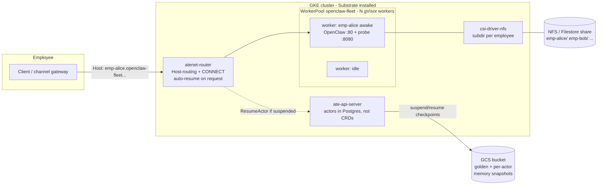

# OpenClaw Fleet on Agent Substrate: per-employee agent workspaces on GKE

This demo is a measured blueprint for operating a **fleet of per-employee
[OpenClaw](https://openclaw.ai) agent workspaces on Substrate** — the shape a
company takes when it gives every employee a personal, persistent AI-agent
workspace that must feel always-on while actually running almost never. It is
the Substrate counterpart of the
[agent-sandbox `openclaw-fleet-gke` example](https://github.com/kubernetes-sigs/agent-sandbox/tree/main/examples/openclaw-fleet-gke),
proving the same six fleet requirements with an asserting test script
([`run-test-gke.sh`](run-test-gke.sh)), and it builds on the single-agent
[always-on-agent](https://github.com/agent-substrate/always-on-agent)
integration (same actor image recipe; no OpenClaw source changes).

| # | Fleet requirement | Substrate mechanism | Verdict (live-tested) |
|---|---|---|---|
| 1 | Fast creation & activation; batch onboarding | `CreateActor` = a DB registration (~2 ms); first request restores the template's **golden snapshot** into a pre-warmed worker | ✅ create; ✅ activation 4 s for real OpenClaw (1.4–2.9 s for a small binary); ❌ no bulk API |
| 2 | Deletion releases every resource | `DeleteActor --any-state` frees the worker, deletes the per-actor CSI volume and every snapshot under the actor's UID prefix | ✅ verified (zero residue) — but wedges after failed restores (gap #3) |
| 3 | Sleep releases compute; wake-up measured; state preserved | `SuspendActor` checkpoints **live memory + rootfs** to GCS and frees the worker; the next request auto-resumes (atenet ext_proc) | ✅ verified with real OpenClaw — wake-on-request p50 ~3.5 s, memory intact; ⚠️ idle *policy* is yours to run (gap #4) |
| 4 | Fleet-wide image/config updates, CPU/mem resizes | none natively — ActorTemplates are **immutable**; the only path is create-template-v2 + repoint each suspended actor (`UpdateActor`), which **discards memory state** | ❌ needs Substrate work; repoint workaround verified (4–5 s downtime, volume survives, memory lost) |
| 5 | Per-employee ~20 GB NAS workspace, thousands of users | `externalVolumeTemplate` → one CSI volume per actor; with `csi-driver-nfs` each volume is a **subdirectory of one NFS/Filestore share**; excluded from snapshots, reattached on resume | ✅ verified incl. suspend/resume reattach and cross-employee isolation; ⚠️ no quota enforcement |
| 6 | Distinct, stable address per employee | `<actor>.<atespace>.actors.resources.substrate.ate.dev`, Host-routed by atenet, **wake-on-request** built in — no per-employee Service/alias objects at all | ✅ verified across create/suspend/wake/repoint — Substrate's strongest answer |

The central design difference from the Kubernetes-native (agent-sandbox)
blueprint: there, a *pod* is the unit of sleep, so waking means rescheduling
and rebooting the app (~20 s), and sub-second onboarding needs a warm pool of
already-running pods. Here, the *process image* is the unit of sleep: every
employee's agent is a suspended memory snapshot, waking resumes it
mid-thought in seconds without any pod churn, and "warm pool" is just the
worker pool every actor multiplexes onto. The trade arrives at update time:
the snapshot **is** the state, so anything that invalidates it (image bump,
resize, key rotation) is a fleet-wide state-loss event to manage.

## Architecture



Employee lifecycle, entirely through the ate API (no portal layer needed —
compare the ~550-line portal the agent-sandbox blueprint carries):

```mermaid
stateDiagram-v2
    [*] --> Registered: CreateActor (ms, DB row only)
    Registered --> Serving: first request<br/>golden restore, seconds
    Serving --> Suspended: SuspendActor<br/>(your idle policy)
    Suspended --> Serving: any request<br/>auto-resume, same memory
    Suspended --> Suspended: UpdateActor -> template v2<br/>(fleet update; memory discarded,<br/>workspace volume kept)
    Serving --> [*]: DeleteActor --any-state<br/>volume + snapshots deleted
```



## Files

| File | Role |
|---|---|
| [`openclaw-fleet.yaml.tmpl`](openclaw-fleet.yaml.tmpl) | Namespace + `WorkerPool`: N gVisor workers = the fleet's *concurrency* ceiling (fleet size is unbounded by it). |
| [`openclaw-fleet-template.yaml.tmpl`](openclaw-fleet-template.yaml.tmpl) | The `ActorTemplate` (protojson, not a CRD): OpenClaw on port 80, test probe on 8080, FULL snapshots, 20 Gi external volume per employee. |
| [`build/`](build/) | Actor image: stock public OpenClaw + fleet config (adapted from always-on-agent). Digest-pinned base — snapshots are image-exact. |
| [`probe/`](probe/) | Test-instrumentation sidecar (Substrate has no `exec` into actors): boot ID + in-memory counter distinguish memory-restore from cold boot; workspace endpoints prove the volume. |
| [`tools/update-actor/`](tools/update-actor/) | Repoints an actor at a new template via `UpdateActor` — the RPC exists but `kubectl-ate` has no verb for it yet. |
| [`deploy.sh`](deploy.sh) | Build images (Cloud Build + ko), worker pool, atespace, template, golden snapshot wait. |
| [`run-test-gke.sh`](run-test-gke.sh) | Asserting walkthrough of requirements 1–6 (section numbering mirrors the agent-sandbox example). |
| [`rolling-update.sh`](rolling-update.sh) | Rate-limited fleet migration to a new template (the lossy update path, made explicit). |
| [`tools/measure-activation-latency.sh`](tools/measure-activation-latency.sh) | suspend/wake percentiles over N cycles. |
| [`teardown.sh`](teardown.sh) | Actors → templates → atespace → pool, in the order that avoids wedging. |

## Walkthrough

### 0. Prerequisites

A GKE cluster that Substrate can run on — the PodCertificate beta APIs must
be enabled **at cluster creation** (GKE 1.36; default-served on 1.37+):

```sh
gcloud container clusters create openclaw-fleet-sub \
  --zone us-east4-a --cluster-version 1.36.4-gke.1082000 \
  --num-nodes 3 --machine-type c3-standard-4 \
  --workload-pool <PROJECT>.svc.id.goog --enable-dataplane-v2 \
  --enable-kubernetes-unstable-apis=certificates.k8s.io/v1beta1/podcertificaterequests,certificates.k8s.io/v1beta1/clustertrustbundles
```

A snapshot bucket with Workload Identity grants for `ate-system/atelet`
**and** `ate-system/ate-api-server` (`roles/storage.objectAdmin` +
`roles/storage.bucketViewer`; missing the api-server half wedges actors on
their second suspend). Then, from this checkout:

```sh
cp hack/ate-dev-env.sh.example .ate-dev-env.sh   # edit project/cluster/bucket
hack/install-ate.sh --deploy-ate-system --setup-csi=nfs
make build-atectl        # kubectl-ate on PATH
```

`--setup-csi=nfs` deploys an in-cluster NFS server + `csi-driver-nfs` +
`CSIDriverConfig` — fine for the demo. For production, point the
`csi-nfs-sc` StorageClass at a Filestore instance instead
(`parameters: {server: <filestore-ip>, share: /<share>}`); the CSI driver
then provisions **one subdirectory per employee on one share**, the same
thousands-of-users shape as the agent-sandbox blueprint, with no per-user
PV/PVC objects.

### 1. Deploy

```sh
export PROJECT_ID=<project> BUCKET_NAME=<snapshot-bucket>
./deploy.sh                                          # template v1
TEMPLATE_NAME=openclaw-fleet-v2 TEMPLATE_REV=v2 ./deploy.sh   # v2, for the update test
```

`deploy.sh` Cloud-Builds the actor image (stock OpenClaw + config), ko-builds
the probe and the ateom worker from this checkout, applies the pool, creates
the atespace + template, and waits for the **golden snapshot** — the one-time
warm-boot of OpenClaw whose checkpoint every employee's first activation
restores from. Onboarding N employees costs N database rows, not N boots.

### 2. Run the asserting test

```sh
BUCKET_NAME=<snapshot-bucket> ./run-test-gke.sh
```

This runs the real OpenClaw actor end to end. `PROBE_ONLY=true` (on both
`deploy.sh` and the test) is a diagnostic mode that runs only the baked-in
probe binary as PID 1 — useful for isolating platform behavior from
workload behavior, which is exactly how the dead-golden failure below was
first localized.

### 3. Fleet update (the honest version)

```sh
ATESPACE=openclaw-fleet ./rolling-update.sh openclaw-fleet-v2
```

Every actor is suspended, repointed, and cold-restores (data-only) on its
next request: config/image now v2, **conversation memory gone, workspace
volume intact**. There is no way to update a fleet without this loss today —
see the gaps section.

## Measured results

Live validation 2026-09-16 on GKE `1.36.4-gke.1082000` (us-east4-a, 3×
`c2d-standard-8`), Substrate `release-0.1` at `v0.1.0-5-g4ae77803` installed
by `hack/install-ate.sh`, gVisor nightly `2026-09-02` asset, worker pool of
5, in-cluster NFS via `--setup-csi=nfs`, **real OpenClaw actor** (stock
2026.8.2 image + fleet config, run with the uid-0/cwd-`/` fixes described in
the gap list). `run-test-gke.sh`: **18/18 assertions passed**, no
`PROBE_ONLY`.

| Metric | Measured | Notes |
|---|---|---|
| `CreateActor` (register employee) | **~2 ms** handler; ~1.9 s wall | wall time is kubectl-ate startup + port-forward, not the control plane |
| Batch-register 10 employees | 2.1 s | no bulk API; client-side fan-out |
| First activation (golden restore → OpenClaw serving on :80) | **3.8–3.9 s** | end-to-end through atenet; HTTP 401 = token auth enforced |
| Wake-on-request after suspend | **3.6 s** (3.3–3.7 s across cycles) | same `boot_id`, in-memory counter intact; matches the unmodified always-on-agent template's 3.3–3.7 s on this cluster |
| Suspend (checkpoint + free worker) | 3.6 s wall | includes ~1.5 s CLI overhead |
| 10 employees over 5 workers | 3.4–4.5 s per first-touch | requires caller-driven suspends (gap #4) |
| Template-v2 repoint downtime | 6.3 s | data-only restore = real cold boot; memory discarded by design |
| Deletion | zero residue | actor list + GCS snapshot prefix verified |
| Golden snapshot size (`pages.img.zstd`) | **60.6 MiB live** vs **20 KiB dead** | the dead-golden signature — see gap #1 |

For scale: the earlier `PROBE_ONLY` runs (a small Go binary as the whole
actor) woke in 1.2 s, so the full Node.js OpenClaw runtime costs ~2.4 s of
extra restore time per wake — size expectations on the real workload, not
on empty-actor figures.

## What works

- **Wake-on-request with a stable per-employee address** is built into the
  data plane: the DNS name is deterministic, survives suspend/resume/
  rescheduling, and a request to a sleeping employee just… works. The
  agent-sandbox blueprint needs a portal, alias Services, and a router
  deployment to approximate this; here it is zero per-employee objects.
- **True memory-state sleep**: the employee's agent resumes with its process
  memory (session context, JIT warm-up) intact — verified by boot-ID and
  in-memory-counter continuity across suspend/resume. Disk-tier sleep in the
  agent-sandbox blueprint reboots the app instead (~20 s wake, state only as
  good as what OpenClaw flushed to disk).
- **Fleet-size decoupling**: registered employees are DB rows; only
  *concurrently active* employees consume compute (1 awake actor : 1 worker).
- **Per-employee volumes with actor-scoped lifecycle**: provisioned at
  create, detached at suspend, deleted at delete — no PV/PVC sprawl.
- **Clean deletion**, including snapshots under the actor's UID prefix and
  the CSI volume.

## What does NOT work yet (Substrate gaps)

Ordered by how hard they bite this use case. Items 1–4 were **discovered or
confirmed during this demo's live validation**; each is reproducible with
the files in this directory.

> **Correction (2026-09-16).** An earlier revision of this list claimed a
> fatal gVisor bug: "a real OpenClaw actor cannot be restored". That was
> wrong, and a colleague running the same gVisor asset successfully called
> it: the golden snapshot had been captured from a sandbox whose OpenClaw
> process had **already exited**. Root cause, proven on a fresh GKE 1.36.4
> cluster: Substrate starts app containers as **uid 0 with cwd `/`** — it
> honors the image's ENTRYPOINT/CMD and ENV but *not* its `USER` or
> `WORKDIR` (`internal/ocispec/ocispec.go:86-92`). The stock image's CMD is
> the relative `node openclaw.mjs gateway`, so from `/` Node died instantly
> (`Error: Cannot find module '/openclaw.mjs'`, verbatim in the golden
> actor's worker log); my absolute-path variants died on OpenClaw's config
> guard because uid 0 resolves `HOME=/root` and never finds the baked
> `/home/node/.openclaw/openclaw.json`. On the very same cluster the
> unmodified always-on-agent template — which sets `HOME=/home/node` and
> runs `node /app/openclaw.mjs gateway --allow-unconfigured …` — produced a
> **60.1 MiB** golden and restored in 4.0 s, while mine produced a **20 KiB**
> golden that failed every restore. The GKE-version hypothesis (1.36.4 vs
> the colleague's 1.35.7) is therefore refuted. The demo's template and
> entrypoint are fixed accordingly, and the earlier "re-validated on main"
> note is moot for item 1: the failure reproduced on main because the bug
> was in this template, not the platform. What *is* a platform gap is
> everything that let a dead golden ship silently — item 1 below.

1. **A dead golden is indistinguishable from a live one — and nothing stops
   it shipping.** Nothing watches the app process after `runsc start` (no
   wait, no liveness, no exit→CRASHED path — `cmd/ateom-gvisor/main.go`
   returns right after start); the golden is a single `runsc checkpoint
   _pause` with no app-container state check, and any non-empty file list
   counts as success; `GoldenSnapshotStatus` exposes **no size or health**,
   so a pause-only ~20–110 KiB golden is marked Ready exactly like a 60 MiB
   live one. Every restore then fails with gVisor's `inconsistent private
   memory files on restore: savedMFOwners = [_pause:/], mfmap =
   map[<app>:/…]` — a message that points at gVisor, not at the exited
   process. Compounding it: Substrate's OCI spec ignores image `USER` and
   `WORKDIR`, which is precisely the kind of drift that makes a
   Docker-tested image die under Substrate. Wanted upstream: honor (or at
   least surface) image `USER`/`WORKDIR`; refuse or flag a golden whose
   app containers have exited; expose golden size in template status; and
   a `readyz`-free liveness gate before checkpoint. Until then: **always
   check `pages.img.zstd` size in GCS after creating a template** (tens of
   KiB = dead; tens of MiB = live) and read the golden actor's worker-pod
   logs during the 20 s warmup.

2. **Snapshots are CPU-feature-pinned and Substrate schedules blind to it.**
   Two of three freshly-created GKE `c3-standard-4` nodes (same zone, same
   machine type, same Xeon 8481C model!) lacked `tsc_deadline_timer`; a
   golden taken on the third node failed FeatureSet validation on the other
   two. Substrate has no CPU-feature-aware placement, no
   checkpoint-compatibility check at scheduling time, and no remediation —
   requests just 500. Worker pools must be kept feature-homogeneous by hand
   (this demo does it with node labels), and one heterogeneous node can
   poison a fleet's snapshots.
3. **Failed restores wedge, poison the pool, and end in data loss.** An
   actor whose restore fails (here: because of the dead golden, but the
   same holds for any restore error) is left `RESUMING` **while still
   holding its worker** (saturating the pool → `no free workers available`
   for everyone else); `DeleteActor --any-state` then fails with
   `TERMINAL_FILE_SYSTEM_ERROR ... sandbox-assets.json: no such file`, and
   the only recovery is deleting the worker *pod*, after which the actor is
   terminal `CRASHED`. There is no automatic cleanup, cold-boot fallback
   (`workflow_resume.go` cold-boots only when *no* snapshot URI exists),
   retry-on-different-worker, or fencing. Reproduced again on 2026-09-16.

4. **No idle preemption: multiplexing is entirely caller-driven.** With 5
   workers and 11 registered employees, the 6th activation parks for its
   5 s budget and 503s — an idle-but-awake actor is never suspended to make
   room. Verified live; `run-test-gke.sh` §1b only passes because it
   suspends after every touch, exactly the loop the always-on-agent
   idle-suspender runs. Density claims assume this loop exists; ship it or
   size pools for peak-concurrent-awake.
5. **No fleet update story.** ActorTemplates are immutable, there is no
   rollout primitive, and repointing an actor (`UpdateActor`) forces a
   data-only restore — memory state is discarded fleet-wide on every image
   or config change. Resizes (`resources.limits`) are also template-bound
   and take effect only on cold boot. Roadmap lists "ActorDeployment"; until
   then [`rolling-update.sh`](rolling-update.sh) is the state of the art.
6. **Secrets are baked into the golden snapshot.** Template env is
   literal-only (no `secretKeyRef` since upstream #835); a provider-key
   rotation means new template + re-golden + lossy fleet migration. Egress
   credential injection is the missing tier.
7. **No bulk APIs.** Onboarding thousands = client-side `CreateActor`
   fan-out; offboarding likewise. Also ~2 s of CLI/port-forward overhead per
   `kubectl ate` invocation dwarfs the ~2 ms RPC — fleet tooling should hold
   one connection.
8. **No `kubectl-ate update actor`** — the RPC exists, the CLI verb doesn't
   (this demo carries [`tools/update-actor`](tools/update-actor/)).
9. **No exec/cp/debug path into actors** — hence the probe pattern this
   demo uses for testing; operators will want something first-class.
10. **Volume capacity is bookkeeping, not enforcement**, with the NFS
    driver: nothing stops an employee filling the shared share past their
    20 Gi. (Filestore multishares or an enforcing CSI driver would fix
    this.)
11. **Static worker pools.** No autoscaling; concurrent-active demand
    beyond the pool parks for ≤5 s, then 503s. Sizing is on you (see the
    always-on-agent density model: P99-peak, not average).
12. **In-cluster-only ingress.** atenet-router is ClusterIP; the external
    per-employee URL (LB, TLS, IAP/SSO) is entirely left to the operator —
    the agent-sandbox blueprint's Gateway-API layer has no counterpart
    here.
13. Minor: `hack/install-ate.sh` labels only currently-present nodes
    (nodes added later run no dataplane until labeled by hand), and a dirty
    working tree yields a `-dirty` version label that no node carries, so
    demo pools silently never schedule.

## How these gaps compare to agent-sandbox

The same six-requirement exercise was run against the
[Kubernetes SIG agent-sandbox `openclaw-fleet-gke` example](https://github.com/kubernetes-sigs/agent-sandbox/tree/main/examples/openclaw-fleet-gke)
(Sandbox / SandboxClaim / SandboxTemplate / SandboxWarmPool CRDs), also
live-validated on GKE. Mapping the 13 gaps above onto that stack shows most
of them are the cost of Substrate's core bet — an agent as a checkpointed
process image under a bespoke control plane — while agent-sandbox's bet (an
agent as a pod under ordinary Kubernetes) inherits everything Kubernetes
already solves, and pays with a different gap list.

### The 13 gaps above, on agent-sandbox

| # | Gap here | On agent-sandbox | Why |
|---|---|---|---|
| 1 | Dead golden ships silently (no liveness gate, no size/health status; image USER/WORKDIR ignored) | Structurally absent | agent-sandbox runs a normal pod: image USER/WORKDIR honored, a crashed container is visible (`CrashLoopBackOff`, restarts, events) and a pool replaces bad spares; there is no checkpoint step to capture a dead process in. |
| 2 | CPU-feature-pinned snapshots, feature-blind scheduling | Same trap, memory tier only, fail-open | Same "same machine series, homogeneous pool, pod-spec-is-the-cache-key" warnings — but a mismatch silently cold-starts instead of wedging; the disk tier is immune. |
| 3 | Failed restore → wedged worker, undeletable actor, terminal CRASHED | Not a gap | No terminal states: level-triggered CRs with conditions; the claim controller falls back to cold start when a warm candidate misbehaves; pools replace bad spares. Failure degrades, nothing wedges. |
| 4 | No idle preemption; saturation parks 5 s then 503s | Half shared | Saturation degrades to a cold start (5.7 s) instead of an error. Idle *detection* is caller-driven there too (portal sweeper + absolute `shutdownTime`) — both roadmaps list auto-suspend as planned. |
| 5 | Immutable templates, lossy repoint, no rollout | Mostly solved | Templates are mutable CRs; `updateStrategy: Recreate` auto-rolls unclaimed warm spares; claimed sandboxes use a rate-limited rebuild (5.2 s downtime). Memory is lost either way, but disk/profile state survives by design. |
| 6 | Secrets baked into template + golden snapshot | Not a gap | The blueprint is a full `corev1.PodSpec`: `secretKeyRef`/`envFrom`/projected volumes; rotation = rotate the Secret. (Only fleet-shared secrets fit the warm path.) |
| 7 | No bulk APIs; ~2 s CLI overhead per call | Structurally absent | Everything is a CRD: `kubectl apply` N claims, list/watch, clientsets, Go/Python SDKs. Measured 174 ms warm claims, ~85 creates/s. |
| 8 | No `kubectl-ate update actor` verb | Structurally absent | No bespoke CLI exists to be incomplete; kubectl over CRDs is complete by construction. |
| 9 | No exec/cp/debug into actors | Not a gap | Sandbox pod = normal pod: `kubectl exec/cp/logs/debug` all work (which is why this demo needs a probe and that one doesn't). |
| 10 | Volume capacity unenforced | Shared, with an escape hatch | Its sub-second bind-mount storage shape has the identical gap, documented; but per-sandbox `volumeClaimTemplates` + Filestore multishares give enforced isolation at the cost of ~15 s cold claims. |
| 11 | Static pools, no autoscaling | Not a gap | `SandboxWarmPool` exposes `/scale` and plugs into HPA/KEDA (shipped examples); over-demand cold-starts rather than 503s. |
| 12 | ClusterIP-only ingress | Not a gap | Ships a sandbox-router (path routing, WebSockets, TokenReview authz) + Gateway API + optional IAP; only identity→URL authorization is operator glue. |
| 13 | Node-label/dataplane install footguns | Structurally absent | No node dataplane at all — one controller Deployment from release manifests; new nodes need nothing. |

Scorecard: 10 of 13 are not gaps there (the Kubernetes-native dividend), two
exist only in its optional GKE memory tier and fail open (#1, #2), one is
shared as a documented trade-off (#10).

### The gaps agent-sandbox has instead

What this demo does natively that agent-sandbox does not — plus what its own
live validation exposed:

1. **Density.** One awake employee = one full gVisor pod, 24/7; no
   multiplexing of idle-but-awake workloads (≥2,250 requested cores for
   9,000 awake seats before a keystroke, vs. actors-over-workers here).
   Multi-sandbox-per-pod is roadmap-only.
2. **Memory-true sleep isn't the platform's.** Native suspend reboots the
   app (22.3 s wake, session memory gone, vs. p50 1.22 s resume-mid-thought
   measured here); the memory tier is GKE Pod Snapshots — manual triggers,
   machine-series-pinned, template-edit-silently-cold-starts, GKE-only.
3. **Late-bind storage lifecycle is unsupported glue with a data-loss
   invariant.** Unbind-before-teardown lives only in example code; an
   out-of-band pod delete wedges pods in Terminating or wipes the
   employee's NFS workspace. No finalizer hook or binding CRD exists.
4. **No in-platform idle detection / auto-suspend / scale-to-zero** (same
   as here; sweeper lives in the example portal).
5. **Warm claims forbid all per-user pod customization**: per-claim
   env/volumes force cold starts, and there is no per-claim resource
   sizing at all — per-employee CPU/memory tiers mean a separate template
   and warm pool per size class.
6. **Sub-second is conditional**: only while the warm pool has spares
   (cold 5.7 s, first pull 27 s); refill throughput bounds batch
   onboarding; the 10k-claim fleet shape is undocumented.
7. **Stable per-user addressing is portal glue**: ExternalName alias +
   two Services per employee vs. this system's zero-object wake-on-request
   DNS — the one place Substrate is decisively ahead.
8. **Example-glue to productionize**: single-replica portal with in-memory
   state, a privileged hostPath-`/` storage daemon whose one shared token
   authorizes deleting any workspace (and whose NetworkPolicy is silently
   inert without Dataplane V2), and edge identity→sandbox authorization.

### Synthesis

The two gap lists are near-duals. Substrate's are *reliability and
operability* gaps in a young bespoke plane (fatal restore bug, terminal
states, missing verbs, no rollouts) under genuinely superior primitives
(wake-on-request addressing, memory-true sleep, heavy density).
agent-sandbox's are *economics and glue* gaps (no multiplexing, memory tier
outsourced to GKE, portal/daemon/alias layer to harden) on a platform where
failure degrades instead of wedging. For an OpenClaw-shaped fleet today,
agent-sandbox can run it in production with known glue costs; Substrate
runs OpenClaw today (4 s activation, ~3.5 s wake) once the template
respects its uid-0/cwd-`/` container contract — and its density and wake
semantics attack exactly the two gaps at the top of agent-sandbox's list.

## Teardown

```sh
BUCKET_NAME=<snapshot-bucket> ./teardown.sh
```

Order matters: actors before templates before atespace before pool —
deleting the pool under awake actors wedges them (`CRASHED` is terminal).
